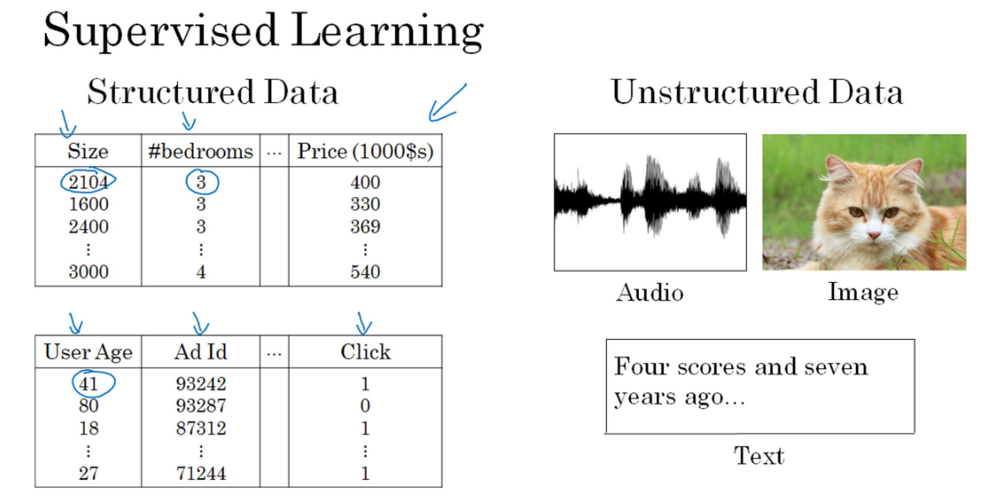

# Week 1 : Introduction to deep learning
Catatan untuk kursus **Neural Networks and Deep Learning**, kursus ke 1 (dari 5 kursus) Spesialisasi Deep Learning dari [Coursera](https://www.coursera.org/specializations/deep-learning) dan [DeepLearning.ai](http://deeplearning.ai/). Diajarkan oleh Andrew Ng.

## Table of contents

- [Week 1 : Introduction to deep learning](#week-1--introduction-to-deep-learning)
  - [Table of contents](#table-of-contents)
  - [Introduction to deep learning](#introduction-to-deep-learning)
    - [What is a (Neural Network) NN?](#what-is-a-neural-network-nn)
    - [Supervised Learning with neural networks](#supervised-learning-with-neural-networks)
    - [Why is deep learning taking off this fast?](#why-is-deep-learning-taking-off-this-fast)

## Introduction to deep learning
Objective :
> Be able to explain the major trends driving the rise of deep learning, and understand where and how it is applied today.

### What is a (Neural Network) NN?
- Jumlah neuron tunggal == Linear Regression
- Contoh graf Neural Network:

  
  Gambar diambil dari [tutorialspoint.com](tutorialspoint.com)

- Perbedaan pada Deep Neural Network dibandingkan Linear Regression adalah pada Hiden Layer. 
- Hidden layer dibangun dari beberapa node yang saling terkoneksi. Node ini dinamakan Artificial Neuron.
- Setiap Node ini nantinya akan memprediksi interkoneksinya terhadap Node lainnya dengan menggunakan Activation Function.
- Deep NN terdiri dari beberapa Hidden Layers (Deeper layers)
  
  
  Gambar diambil dari [opennn.net](opennn.net)

- Setiap input akan terhubung dengan Hidden Layer dan NN akan menentukan koneksinya.
- Supervised Learning artinya adalah kita mempunyai sepasang variabel (X, Y) lalu kita akan mencari fungsi yang memetakan X ke Y dengan melakukan proses training.
- Salah satu terobosan besar pada penelian Neural Network adalah ReLU (Reactifies Linear Unit). ReLU adalah Activation Function yang membuat proses Training model lebih cepat jika dibandingkan dengan sigmoid dan tan hiperbolik.

### Supervised Learning with neural networks
- Beberapa tipe dari NN untuk Supervised Learning:
  - CNN (Convolutional Neural Network) berguna untuk Computer Vision
  - RNN (Recurrent neural networks) Berguna untuk Speech Recognition (NLP)
  - Standard NN Berguna untuk data terstruktur.
  - Hybrid/custom
  
  

- Data terstruktur : database dan table.
- Data tidak terstruktur : images, video, audio, and text.

- Secara singkat Supervised Learning adalah "learn some function on input x which shall predict output y". Contoh Supervised Learning :

|Contoh|input(X)|output(Y)|Metode|
|---|---|---|---|
|Real Estate|Home Features (Lokasi Rumah, Luas Tanah, Bangunan, dll.)|Price|Standard NN|
|Online Advertising|Ad, User Info|click on ad (0/1)|Standard NN|
|photo tagging|Image|Pixel (1....10000)|CNN|
Speech Recognition|Audio|Text transcript|A-D temporal data or 1-D time series data RNN|
|Machine translation|English|Hindi|More complex version of RNN|
|Autonomous driving|Image, Radar info|Position of other cars|Custom hybrid version of CNN and RNN's|

### Why is deep learning taking off this fast?
- Alasan mengapa Deep Learning berkembang cepat:
  1. Data :
     
     - Data yang besar membuat Linear Regression ataupun SVN tidak memberikan performa yang signifikan.
     - Maka dari itu Neural Network memberikan peforma yang lebih baik seiring dengan bertambahnya data.
     - Hopefully we have a lot of data because the world is using the computer a little bit more
       - Mobiles
       - IOT (Internet of things)
  2. Komputasi:
     - GPUs.
     - Powerful CPUs.
     - Distributed computing.
     - ASICs
  3. Algoritma:
     1. Berbagai terobosan pada fungsi matematis dan algoritma yang akhirnya dapat diadopsi pada bidang Neural Network.
        - Contohnya penggunaan Activation Function ReLU jauh lebih baik dibandingkan menggunakan SIGMOID function saat training NN karena mampu mengeliminasi permasalahan gradien.

  
Sumber :
- Deeplearning.ai course
- https://github.com/mbadry1/DeepLearning.ai-Summary
- https://github.com/ppant/deeplearning.ai-notes

Catatan dari by [Muhammad Valdie Arsanur](mailto:mvasecondary@gmail.com)
