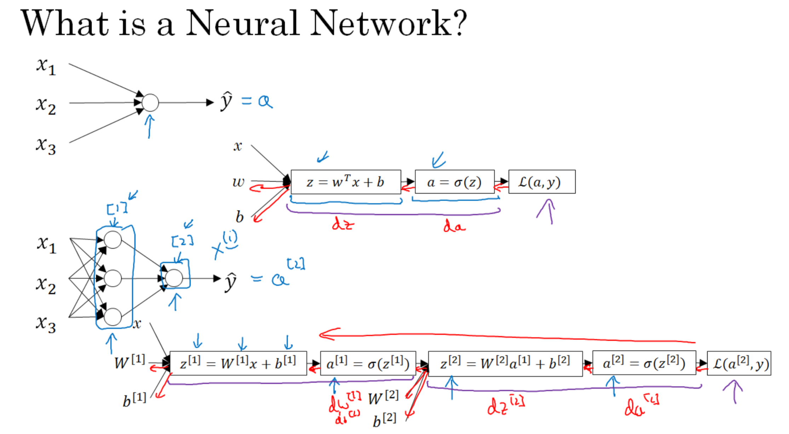
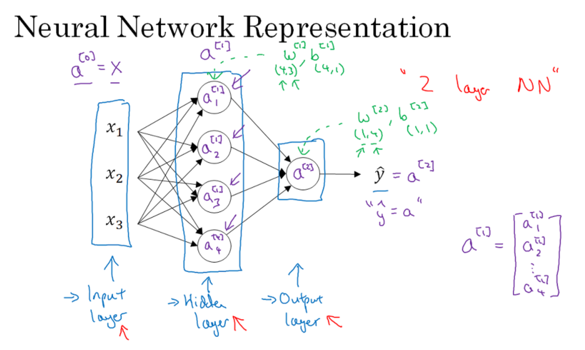
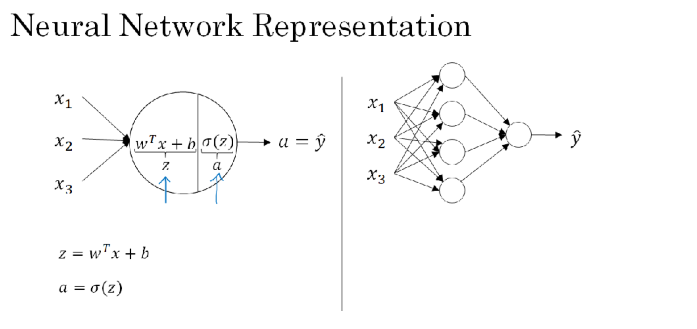
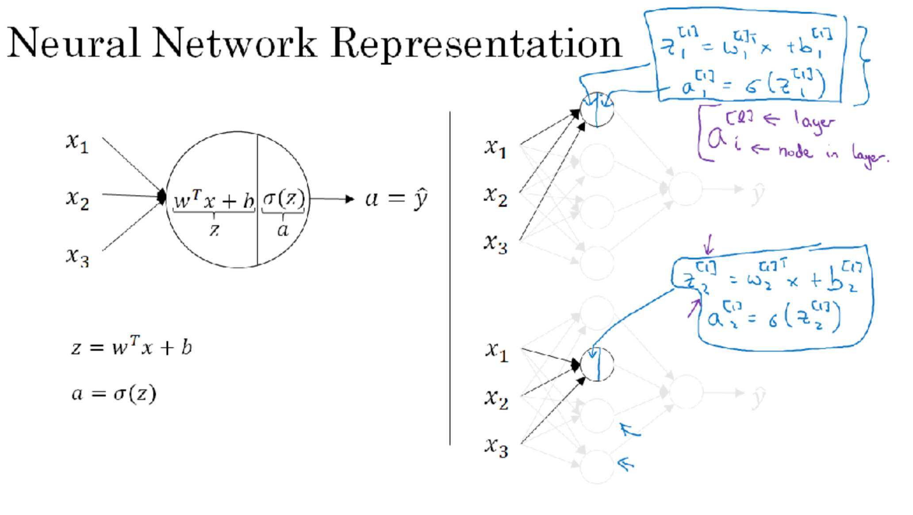
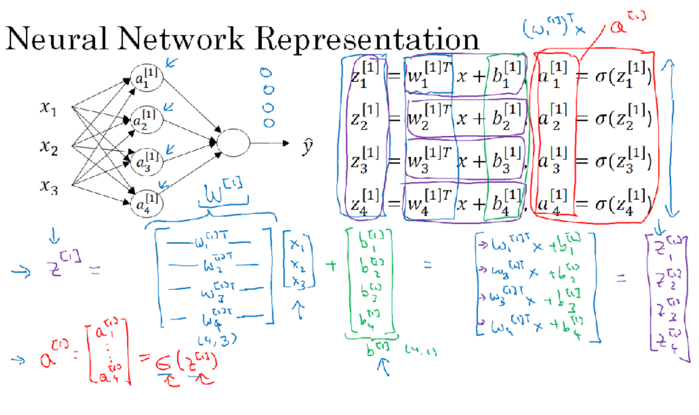
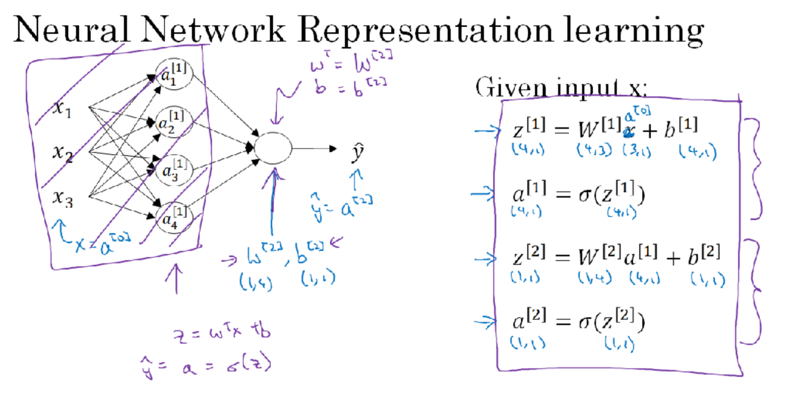

# Week 3 : Shallow neural networks
Catatan untuk kursus **Neural Networks and Deep Learning**, kursus ke 1 (dari 5 kursus) Spesialisasi Deep Learning dari [Coursera](https://www.coursera.org/specializations/deep-learning) dan [DeepLearning.ai](http://deeplearning.ai/). Diajarkan oleh Andrew Ng.

## Table of contents

- [Week 3 : Shallow neural networks](#week-3--shallow-neural-networks)
  - [Table of contents](#table-of-contents)
  - [Shallow neural networks](#shallow-neural-networks)
    - [Neural Networks Overview](#neural-networks-overview)
    - [Neural Network Representation](#neural-network-representation)
    - [Computing a Neural Network's Output](#computing-a-neural-networks-output)
    - [Vectorizing across multiple examples](#vectorizing-across-multiple-examples)
    - [Activation functions](#activation-functions)
    - [Why do you need non-linear activation functions?](#why-do-you-need-non-linear-activation-functions)
    - [Derivatives of activation functions](#derivatives-of-activation-functions)
    - [Gradient descent for Neural Networks](#gradient-descent-for-neural-networks)
    - [Random Initialization](#random-initialization)


## Shallow neural networks

> Learn to build a neural network with one hidden layer, using forward propagation and backward propagation.

### Neural Networks Overview 

Cara yang umum digunakan untuk membangun Neural Network :
1. Definisikan struktur Neural Network (jumlah input dan hidden unit)
2. Inisialisasi parameter dari Model
3. Loop:
    - Lakukan forward propagation
    - Hitung Loss
    - Lakukan backward propagation untuk mendapatkan gradient
    - Update parameter (Gradient Descent)

--


- Diagram pertama menunjukkan Linear Regression (merepresentasikan Single Layer Neural Network)
- Diagram kedua menunjukkan detail dari Node diagram pertama.
  - Dari tiap input feature `x`, kita akan dapatkan linear function `z` menggunakan parameter `w` dan bias `b`.
  - Selanjutnya kita menghitung activation function `a` dari `z`.
  - Selanjutnya kita menghitung Loss Function.
- Diagram ketiga menunjukkan Neural Network dengan 2 layer. Layer pertama 3 unit, layer kedua 1 unit.
  - Jumlah unit 2
  - Jumlah hidden unit 1
  - Layer 1 di notasikan dengan superscript [1]
    - `z[1]` (linear function), `a[1]` (activation function), `w[1]` (weight), `b[1]` (bias)
  - Layer 2 dinotasikan dengan superscript [2]
    - `z[2]`, `a[2]`, `w[2]` , `b[2]`
  - Unit notasikan dengan subscript (...), misal a[1] (2) menunjukkan Unit ke-2 pada layer 1.
- Dapat diketahui pola dari 2 buah Neural Network tersebut
  - Menghitung liniear function `z`, lalu menghitung activation `a`.
  - Terakhir, menghitung Loss Function
  - Diagram tersebut memiliki kalkulasi maju dari x, w, b -> a -> z (Forward Prop); Dan mundur untuk menghitung derivatif da -> dz -> dw, db

### Neural Network Representation

- x1, x2, x3 dinamakan input feature
- pada hidden layer, setiap unit merepresentasikan Activation Funtion
- output layer terdiri 1 buah unit yang kita sebut sebagai prediksi. prediksi dinotasikan dengan `yhat`. Dengan kata lain `a[2] = yhat`.

### Computing a Neural Network's Output






- Keterangan:
  - `JumlahNeuron = 4`
  - `Nx = 3`
  - Variabel dan Ukuran:
    - `W1` = Matriks Weight Hidden Layer 1 `(JumlahNeuron, nx)`
    - `b1` = Matriks bias Hidden Layer 1 `(JumlahNeuron, 1)`
    - `z1` = Linear Function `z1 = W1*X + b` `(JumlahNeuron, 1)`
    - `a1` = Activation Function `a1 = sigmoid(z1)` `(JumlahNeuron, 1)`
    - `W2` = Matriks Weight Hidden Layer 2 `(1, JumlahNeuron)`
    - `b2` = Matriks bias Hidden Layer 2 `(1, 1)`
    - `z2` = Linear Function `z2 = W2*a1 + b` `(1, 1)`
    - `a2` = Activation Function `a2 = sigmoid(z2)` `(1, 1)`

### Vectorizing across multiple examples

- Misalnya kita mempunyai input `X` dengan ukuran `(Nx,m)`. Pseudo code Forward Propagation NN 2 layer:

  ```
  for i = 1 to m
    z[1, i] = W1*x[i] + b1      # shape of z[1, i] is (noOfHiddenNeurons,1)
    a[1, i] = sigmoid(z[1, i])  # shape of a[1, i] is (noOfHiddenNeurons,1)
    z[2, i] = W2*a[1, i] + b2   # shape of z[2, i] is (1,1)
    a[2, i] = sigmoid(z[2, i])  # shape of a[2, i] is (1,1)
  ```

- Vektorisasi membuat pseudo code di atas jadi lebih pendek :

  ```
  Z1 = W1X + b1     # shape of Z1 (noOfHiddenNeurons,m)
  A1 = sigmoid(Z1)  # shape of A1 (noOfHiddenNeurons,m)
  Z2 = W2A1 + b2    # shape of Z2 is (1,m)
  A2 = sigmoid(Z2)  # shape of A2 is (1,m)
  ```

- If you notice always m is the number of columns.
- Jika pada contoh section sebelumnya dikatakan input unit `X` = `A0`, maka pseudo code dapat ditulis sebagai berikut:

  ```
  Z1 = W1A0 + b1    # shape of Z1 (noOfHiddenNeurons,m)
  A1 = sigmoid(Z1)  # shape of A1 (noOfHiddenNeurons,m)
  Z2 = W2A1 + b2    # shape of Z2 is (1,m)
  A2 = sigmoid(Z2)  # shape of A2 is (1,m)
  ```

### Activation functions

- Sebelumnya, kita menggunakan Sigmoid Function sebagai Activation Function. Pada kasus lain, terdapat alternatif selain Sigmoid agar komputasi lebih optimal
- Sigmoid can lead us to gradient decent problem where the updates are so low.
- Sigmoid activation function range is [0,1]
  `A = 1 / (1 + np.exp(-z)) # Where z is the input matrix`
- Tanh activation function range is [-1,1]   (Shifted version of sigmoid function)
  - In NumPy we can implement Tanh using one of these methods:
    `A = (np.exp(z) - np.exp(-z)) / (np.exp(z) + np.exp(-z)) # Where z is the input matrix`

    Or
    `A = np.tanh(z)   # Where z is the input matrix`
- It turns out that the tanh activation usually works better than sigmoid activation function for hidden units because the mean of its output is closer to zero, and so it centers the data better for the next layer.
- Sigmoid or Tanh function disadvantage is that if the input is too small or too high, the slope will be near zero which will cause us the gradient decent problem.
- One of the popular activation functions that solved the slow gradient decent is the RELU function.
  `RELU = max(0,z) # so if z is negative the slope is 0 and if z is positive the slope remains linear.`
- So here is some basic rule for choosing activation functions, if your classification is between 0 and 1, use the output activation as sigmoid and the others as RELU.
- Leaky RELU activation function different of RELU is that if the input is negative the slope will be so small. It works as RELU but most people uses RELU.
  `Leaky_RELU = max(0.01z,z)  #the 0.01 can be a parameter for your algorithm.`
- In NN you will decide a lot of choices like:
  - No of hidden layers.
  - No of neurons in each hidden layer.
  - Learning rate.       (The most important parameter)
  - Activation functions.
  - And others..
- It turns out there are no guide lines for that. You should try all activation functions for example.

### Why do you need non-linear activation functions?

- If we removed the activation function from our algorithm that can be called linear activation function.
- Linear activation function will output linear activations
  - Whatever hidden layers you add, the activation will be always linear like logistic regression (So its useless in a lot of complex problems)
- You might use linear activation function in one place - in the output layer if the output is real numbers (regression problem). But even in this case if the output value is non-negative you could use RELU instead.

### Derivatives of activation functions

- Derivation of Sigmoid activation function:

  ```
  g(z) = 1 / (1 + np.exp(-z))
  g'(z) = (1 / (1 + np.exp(-z))) * (1 - (1 / (1 + np.exp(-z))))
  g'(z) = g(z) * (1 - g(z))
  ```

- Derivation of Tanh activation function:

  ```
  g(z)  = (e^z - e^-z) / (e^z + e^-z)
  g'(z) = 1 - np.tanh(z)^2 = 1 - g(z)^2
  ```

- Derivation of RELU activation function:

  ```
  g(z)  = np.maximum(0,z)
  g'(z) = { 0  if z < 0
            1  if z >= 0  }
  ```

- Derivation of leaky RELU activation function:

  ```
  g(z)  = np.maximum(0.01 * z, z)
  g'(z) = { 0.01  if z < 0
            1     if z >= 0   }
  ```

### Gradient descent for Neural Networks
- In this section we will have the full back propagation of the neural network (Just the equations with no explanations).
- Gradient descent algorithm:
  - NN parameters:
    - `n[0] = Nx`
    - `n[1] = NoOfHiddenNeurons`
    - `n[2] = NoOfOutputNeurons = 1`
    - `W1` shape is `(n[1],n[0])`
    - `b1` shape is `(n[1],1)`
    - `W2` shape is `(n[2],n[1])`
    - `b2` shape is `(n[2],1)`
  - Cost function `I =  I(W1, b1, W2, b2) = (1/m) * Sum(L(Y,A2))`
  - Then Gradient descent:

    ```
    Repeat:
    		Compute predictions (y'[i], i = 0,...m)
    		Get derivatives: dW1, db1, dW2, db2
    		Update: W1 = W1 - LearningRate * dW1
    				b1 = b1 - LearningRate * db1
    				W2 = W2 - LearningRate * dW2
    				b2 = b2 - LearningRate * db2
    ```

- Forward propagation:

  ```
  Z1 = W1A0 + b1    # A0 is X
  A1 = g1(Z1)
  Z2 = W2A1 + b2
  A2 = Sigmoid(Z2)      # Sigmoid because the output is between 0 and 1
  ```

- Backpropagation (derivations):   
  ```
  dZ2 = A2 - Y      # derivative of cost function we used * derivative of the sigmoid function
  dW2 = (dZ2 * A1.T) / m
  db2 = Sum(dZ2) / m
  dZ1 = (W2.T * dZ2) * g'1(Z1)  # element wise product (*)
  dW1 = (dZ1 * A0.T) / m   # A0 = X
  db1 = Sum(dZ1) / m
  # Hint there are transposes with multiplication because to keep dimensions correct
  ```
- How we derived the 6 equations of the backpropagation:   
  

### Random Initialization

- In logistic regression it wasn't important to initialize the weights randomly, while in NN we have to initialize them randomly.

- If we initialize all the weights with zeros in NN it won't work (initializing bias with zero is OK):
  - all hidden units will be completely identical (symmetric) - compute exactly the same function
  - on each gradient descent iteration all the hidden units will always update the same

- To solve this we initialize the W's with a small random numbers:

  ```
  W1 = np.random.randn((2,2)) * 0.01    # 0.01 to make it small enough
  b1 = np.zeros((2,1))                  # its ok to have b as zero, it won't get us to the symmetry breaking problem
  ```

- We need small values because in sigmoid (or tanh), for example, if the weight is too large you are more likely to end up even at the very start of training with very large values of Z. Which causes your tanh or your sigmoid activation function to be saturated, thus slowing down learning. If you don't have any sigmoid or tanh activation functions throughout your neural network, this is less of an issue.

- Constant 0.01 is alright for 1 hidden layer networks, but if the NN is deep this number can be changed but it will always be a small number.


<br><br>
Sumber :
- Deeplearning.ai course
- https://github.com/mbadry1/DeepLearning.ai-Summary
- https://github.com/ppant/deeplearning.ai-notes

Catatan dari by [Muhammad Valdie Arsanur](mailto:mvasecondary@gmail.com)
