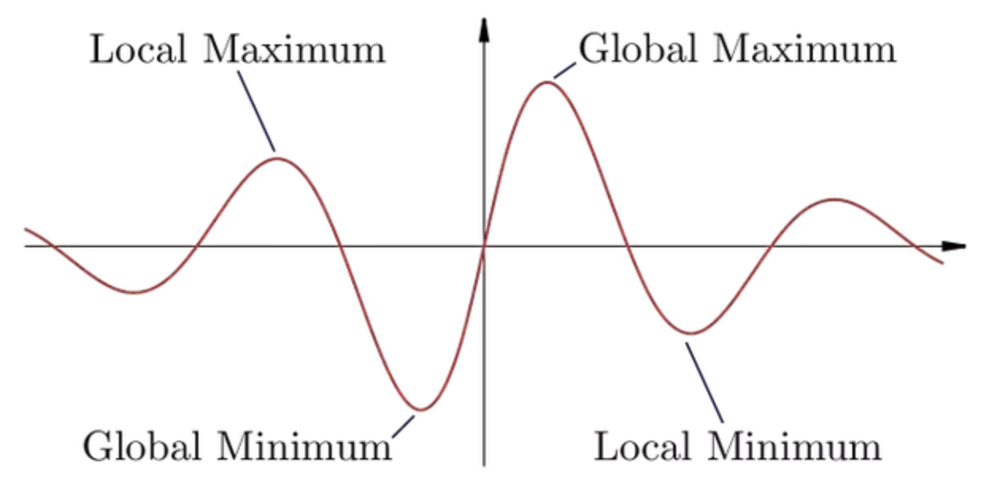
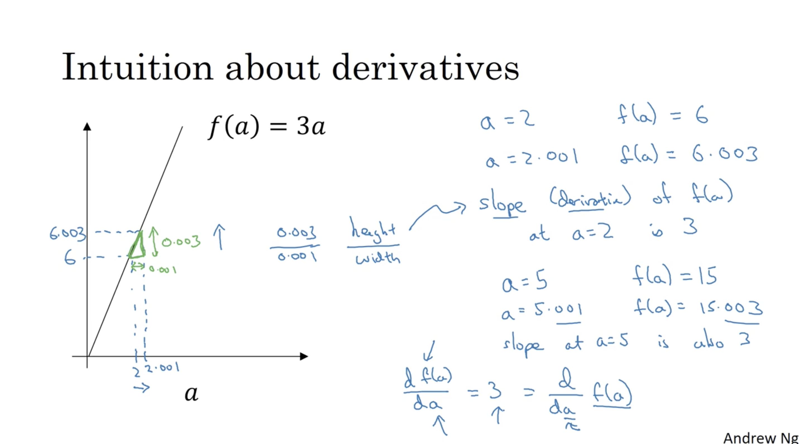
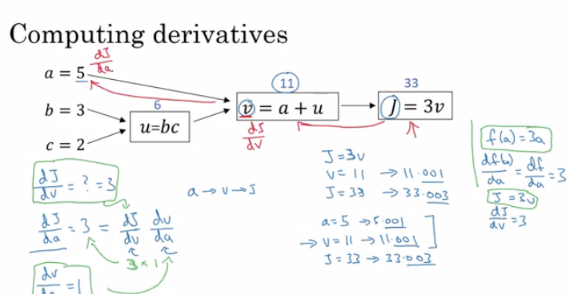
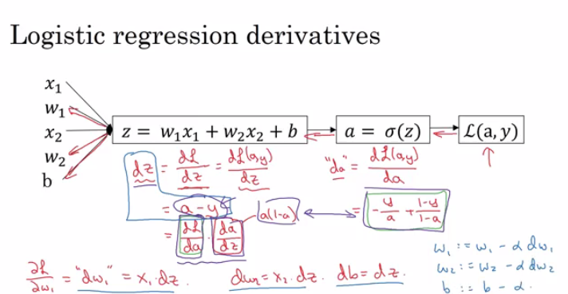

# Week 2 : Neural Networks Basics
Catatan untuk kursus **Neural Networks and Deep Learning**, kursus ke 1 (dari 5 kursus) Spesialisasi Deep Learning dari [Coursera](https://www.coursera.org/specializations/deep-learning) dan [DeepLearning.ai](http://deeplearning.ai/). Diajarkan oleh Andrew Ng.

## Table of contents

- [Week 2 : Neural Networks Basics](#week-2--neural-networks-basics)
  - [Table of contents](#table-of-contents)
  - [Neural Networks Basics](#neural-networks-basics)
    - [Binary classification](#binary-classification)
    - [Logistic regression](#logistic-regression)
    - [Logistic regression Cost Function (dan Loss Function)](#logistic-regression-cost-function-dan-loss-function)
    - [Gradient Descent](#gradient-descent)
    - [Derivatives](#derivatives)
    - [More Derivatives examples](#more-derivatives-examples)
    - [Computation Graph](#computation-graph)
    - [Derivatives with a Computation Graph](#derivatives-with-a-computation-graph)
    - [Logistic Regression Gradient Descent](#logistic-regression-gradient-descent)
    - [Gradient Descent on m Examples](#gradient-descent-on-m-examples)
    - [Vectorization](#vectorization)
    - [Vectorizing Logistic Regression](#vectorizing-logistic-regression)
    - [Notes on Python and NumPy](#notes-on-python-and-numpy)


## Neural Networks Basics
Objective :
> Learn to set up a machine learning problem with a neural network mindset. Learn to use vectorization to speed up your models.

### Binary classification

- Logistic Regression adalah algoritma yang digunakan untuk Binary Classification.
- Sebagai contoh klasifikasi suatu foto (X) yang merupakan Kucing (Y=1) dan bukan Kucing (Y=0).
  - Setiap gambar terdiri dari 3 buah matriks yang merepresentasikan channel dari gambar (RGB). 
  - Jika ukuran gambar 64x64 piksel, matriks R, G, dan B pun akan berukuran 64x64. 
  - Agar gambar tersebut bisa dijadikan input feature (X), gambar perlu diubah menjadi Vektor. Input Feature dari gambar tersebut akan berukuran 64x64x3 = 12288
- Beberapa notasi yang digunakan:
  - `M is the number of training vectors`
  - `Nx is the size of the input vector`
  - `Ny is the size of the output vector`
  - `X(1) is the first input vector`
  - `Y(1) is the first output vector`
  - `X = [x(1) x(2).. x(M)]`
  - `Y = (y(1) y(2).. y(M))`
- NumPy membuat operasi terhadap matriks jauh lebih cepat dan penulisan code lebih singkat.

### Logistic regression

- Logistic regression digunakan pada permasalahan supervised learning, khususnya untuk klasifikasi 2 kelas / Binary Classification (output y bernilai 0 atau 1).
- Logistic regression juga bisa dikatakan sebagai bentuk terkecil dari Neural Network (Shallow Neural Network). 
- Tujuan logistic regression adalah meminimalkan error yang terjadi antara data training dan prediksi.
- Cara kerja Logistic Regression : diberikan input `x` berdimensi `Nx`, lalu Logistic Regression akan memberikan prediksi `yhat`, yaitu probabilitas dari `y`.
  - Pada laskus klasifikasi citra kucing y=1 dan bukan kucing y=0, kita ingin menghitung probabilitas y=1 jika diberikan input citra `x`. `yhat = P(y=1|x)`.
- Persamaan:
  - Persamaan senderhana:	`yhat = wx + b`
  - Jika x adalah vektor: `yhat = wTx + b`
    - `wT` artinya transpose dari `w`
    - `w` adalah vektor berdimensi `Nx` dan `b` adalah bilangan rill.
  - untuk membuat `yhat` berada pada rentang [0, 1] `yhat = sigmoid(w(transpose)x + b)`


### Logistic regression Cost Function (dan Loss Function)

- Diberikan beberapa data untuk training {(x1, y1), (x2, y2), (x3, y3) ... (xm, ym)}. Pada proses training, kita menginginkan nilai prediksi sesuai dengan nilai sebenarnya, `yhat(i) = y(i)`. Loss (galat) diperlukan untuk mengetahui seberapa baik prediksi yang kita buat.
- `Loss Function` adalah perhitungan galat (error) untuk 1 buat data training. Sedangkan `Cost Function` adalah rata-rata galat dari seluruh data training.
- Sederhananya, Cost Function bisa didapatkan dari rumus Square Root Error `L(y',y) = 1/2 (y' - y)^2`.
  - Namun kita tidak akan menggunakan rumus ini karena tidak optimal.
  - Dikatakan bahwa rumus ini hanya memberikan nilai optimum local - yang singkatnya training yang kita lakukan tidak optimal untuk semua data training.
  
- Berikut fungsi yang kita gunakan untuk Cost Function `L(y',y) = - (y*log(y') + (1-y)*log(1-y'))`
- To explain the last function lets see:
  - if `y = 1` ==> `L(y',1) = -log(y')`  ==> we want `y'` to be the largest   ==> `y`' biggest value is 1
  - if `y = 0` ==> `L(y',0) = -log(1-y')` ==> we want `1-y'` to be the largest ==> `y'` to be smaller as possible because it can only has 1 value.
- Pada saat melakukan training, kita akan mempunyai `m` buah data training yang dijabarkan sebagai berikut `(Y, X) = {(x1, y1), (x2, y2), ..., (xm, ym)}`
- Cost function untuk `m` buat data training adalah sebagai berikut `J(w, b) = (1/m) * Sum(L(y'[i],y[i]))`

### Gradient Descent

- Gradient Descent `J(w,b)` adalah fungsi yang kita gunakan mencari parameter `w` dan `b` yang optimal, sehingga meminimalkan Cost Function.
- Maka dari itu grafik dari Gradient Descent terdiri dari 3 sumbu : w, b dan J(w,b).
- di dalam fungsi Gradient Descent, terdapat iterasi untuk mencari nilai optimal.
- Secara intuitif kita bisa menyimpulkan titik optimal dari grafik di bawah.


- `w` di inisialialisasi dengan nilai random,  dan `b` dengan nilai `0.0`
- setelah itu lakukan iterasi untuk mengubah nilai w sampai nilai J konvergen.
```
Repeat {
  w := w - alpha dw
  b := b - alpha db
}
```
- alpha adalah learning rate.
- `dw` (notasi lengkapnya `J(w,b)/dw`) adalah slope dari `w`
- `db` (notasi lengkapnya `J(w,b)/dw`) adalah slope dari `b`
- slope disini berguna untuk menggerakkan parameter searah dengan fungsi parameter tersebut. Jika `w` berbentuk parabola, maka `w` harus bergeser searah parabola tersebut.
- Learning Rate berguna untuk menentukan seberapa jauh step perubahan pada w. Makin tinggi Learning Rate, makin jauh juga step perubahan dari parameter.

### Derivatives
- Memahami intuisi dari derivatif dapat dilakukan dengan melakukan plottong fungsi.
- Misalnya kita memiliki fungsi linier f(a) = 3a.
Pada `a=2, f(a)=6`; pada `a = 2.001, f(a)=6.003`. Jika diperhatikan, pergeseran nilai sebesar 0.001 menyebabkan fungsi f(a) bertambah 0.003. Jadi bisa dikatakan, berapapun nilai a, f(a) berubah sebesar 3 kali lipat. Dengan kata lain, derivatif f(a)=3, `df(a)/da=3`.
- Dapat dikatakan juga, derivatif adalah menghitung panjang/lebar sebuah segitiga, dimana 0.003/0.001=3.
- Secara formal, derivatif dapat ditulis sebagai df(a)/da.



### More Derivatives examples

- `f(a) = a^2`  ==> `d(f(a))/d(a) = 2a`
  - `a = 2`  ==> `f(a) = 4`
  - `a = 2.0001` ==> `f(a) = 4.0004` approx.
- `f(a) = a^3`  ==> `d(f(a))/d(a) = 3a^2`
- `f(a) = log(a)`  ==> `d(f(a))/d(a) = 1/a`


### Computation Graph

- Komputasi pada Neural Network dilakukan dalam 2 arah, Forward dan Backward.
  - Forward Propagation untuk menghitung output dari Neural Network.
  - Backward Propagation untuk menghitung menghitung slope / gradient / derivative.
- Computation Graph membantu untuk mengorganisir arah komputasi tersebut.


### Derivatives with a Computation Graph

- Chain Rule :
  Jika `x -> y -> z` (x mengakibatkan y dan y mengakibatkan z),
  Maka `d(z)/d(x) = d(z)/d(y) * d(y)/d(x)`
- The video illustrates a big example.
  
- We compute the derivatives on a graph from right to left and it will be a lot more easier.
- `dvar` means the derivatives of a final output variable with respect to various intermediate quantities.

### Logistic Regression Gradient Descent

- In the video he discussed the derivatives of gradient decent example for one sample with two features `x1` and `x2`.
  

### Gradient Descent on m Examples

- Dari variabel di bawah:

| variabel | keterangan |
|---|---|
| X1, X2 | Input Feature |
W1 | Weight of the first feature |
W2 | Weight of the second feature |
B | Logistic Regression |
M | Jumlah Training Example |
Y(i) | Harapan Output dari Training Example i |

- Kita mendapatkan :
  

- Then from right to left we will calculate derivations compared to the result:

  ```
  d(a)  = d(l)/d(a) = -(y/a) + ((1-y)/(1-a))
  d(z)  = d(l)/d(z) = a - y
  d(W1) = X1 * d(z)
  d(W2) = X2 * d(z)
  d(B) = d(z)
  ```

- From the above we can conclude the logistic regression pseudo code:

  ```
  J = 0; dw1 = 0; dw2 =0; db = 0;                 # Devs.
  w1 = 0; w2 = 0; b=0;							# Weights
  for i = 1 to m
    # Forward pass
    z(i) = W1*x1(i) + W2*x2(i) + b
    a(i) = Sigmoid(z(i))
    J += (Y(i)*log(a(i)) + (1-Y(i))*log(1-a(i)))
    
    # Backward pass
    dz(i) = a(i) - Y(i)
    dw1 += dz(i) * x1(i)
    dw2 += dz(i) * x2(i)
    db  += dz(i)
  J /= m
  dw1/= m
  dw2/= m
  db/= m
  
  # Gradient descent
  w1 = w1 - alpa * dw1
  w2 = w2 - alpa * dw2
  b = b - alpa * db
  ```

- The above code should run for some iterations to minimize error.

- So there will be two inner loops to implement the logistic regression.

- Vectorization is so important on deep learning to reduce loops. In the last code we can make the whole loop in one step using vectorization!

### Vectorization

- Deep learning shines when the dataset are big. However for loops will make you wait a lot for a result. Thats why we need vectorization to get rid of some of our for loops.
- NumPy library (dot) function is using vectorization by default.
- The vectorization can be done on CPU or GPU thought the SIMD operation. But its faster on GPU.
- Whenever possible avoid for loops.
- Most of the NumPy library methods are vectorized version.

### Vectorizing Logistic Regression

- We will implement Logistic Regression using one for loop then without any for loop.
- As an input we have a matrix `X` and its `[Nx, m]` and a matrix `Y` and its `[Ny, m]`.
- We will then compute at instance `[z1,z2...zm] = W' * X + [b,b,...b]`. This can be written in python as:

    		Z = np.dot(W.T,X) + b    # Vectorization, then broadcasting, Z shape is (1, m)
    		A = 1 / 1 + np.exp(-Z)   # Vectorization, A shape is (1, m)

- Vectorizing Logistic Regression's Gradient Output:

   			dz = A - Y                  # Vectorization, dz shape is (1, m)
   			dw = np.dot(X, dz.T) / m    # Vectorization, dw shape is (Nx, 1)
   			db = dz.sum() / m           # Vectorization, dz shape is (1, 1)

### Notes on Python and NumPy

- In NumPy, `obj.sum(axis = 0)` sums the columns while `obj.sum(axis = 1)` sums the rows.
- In NumPy, `obj.reshape(1,4)` changes the shape of the matrix by broadcasting the values.
- Reshape is cheap in calculations so put it everywhere you're not sure about the calculations.
- Broadcasting works when you do a matrix operation with matrices that doesn't match for the operation, in this case NumPy automatically makes the shapes ready for the operation by broadcasting the values.
- Some tricks to eliminate all the strange bugs in the code:
  - If you didn't specify the shape of a vector, it will take a shape of `(m,)` and the transpose operation won't work. You have to reshape it to `(m, 1)`
  - Try to not use the rank one matrix in ANN
  - Don't hesitate to use `assert(a.shape == (5,1))` to check if your matrix shape is the required one.
  - If you've found a rank one matrix try to run reshape on it.
- Jupyter / IPython notebooks are so useful library in python that makes it easy to integrate code and document at the same time. It runs in the browser and doesn't need an IDE to run.
  - To open Jupyter Notebook, open the command line and call: `jupyter-notebook` It should be installed to work.
- To Compute the derivative of Sigmoid:

  ```
  	s = sigmoid(x)
  	ds = s * (1 - s)       # derivative  using calculus
  ```

- To make an image of `(width,height,depth)` be a vector, use this:

  ```
  v = image.reshape(image.shape[0]*image.shape[1]*image.shape[2],1)  #reshapes the image.
  ```

- Gradient descent converges faster after normalization of the input matrices.


<br><br>
Sumber :
- Deeplearning.ai course
- https://github.com/mbadry1/DeepLearning.ai-Summary
- https://github.com/ppant/deeplearning.ai-notes

Catatan dari by [Muhammad Valdie Arsanur](mailto:mvasecondary@gmail.com)
